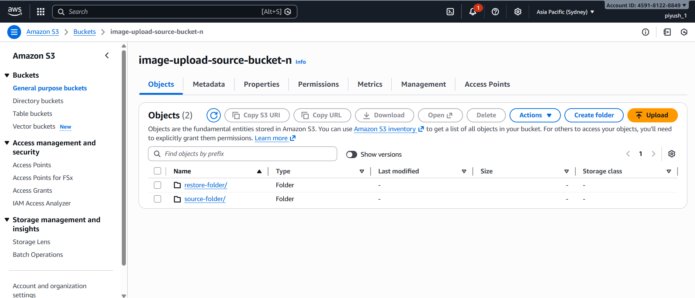

# Image-Resizing
S3 Image Resizing Using AWS Lambda  

  

1. Introduction 

This document explains the implementation of an AWS S3–Lambda pipeline where uploading an image to a source S3 bucket automatically triggers an AWS Lambda function. The Lambda function resizes the image using the Pillow (PIL) library and uploads the resized image to a destination S3 bucket. 

 

2. Objective 

Upload an image (.jpg, .jpeg, .png) to a source S3 bucket 

Automatically trigger a Lambda function 

Resize the image to 300×300 pixels 

Store the resized image in a destination S3 bucket 

 

3. Architecture Overview 

Flow: 

User uploads image to Source S3 Bucket 

S3 triggers AWS Lambda 

Lambda downloads image from S3 

Lambda resizes image using Pillow 

Lambda uploads resized image to Destination S3 Bucket 

 

4. AWS Services Used 

Amazon S3 – Object storage for source and destination images 

AWS Lambda – Serverless compute for image processing 

AWS IAM – Permissions for Lambda to access S3 

AWS CloudShell – Used to build the Pillow Lambda Layer 

 

5. Prerequisites 

AWS Account 

Two S3 buckets (same region): 

Source bucket 

Destination bucket 

Lambda runtime: Python 3.10 

Lambda memory: 512 MB or higher 

Pillow library added via Lambda Layer 

 

6. Lambda Layer Setup (Pillow) 

Lambda does not include image-processing libraries by default, so Pillow must be added using a Lambda Layer. 

Steps: 

Open AWS CloudShell 

Run the following commands: 

rm -rf pillow-layer 

mkdir pillow-layer 

cd pillow-layer 

mkdir python 

  

pip3 install pillow \ 

--platform manylinux2014_x86_64 \ 

--implementation cp \ 

--python-version 310 \ 

--only-binary=:all: \ 

--target python 

  

zip -r pillow-layer.zip python 

Go to AWS Lambda → Layers → Create layer 

Upload pillow-layer.zip 

Select: 

Runtime: Python 3.10 

Architecture: x86_64 

 

7. IAM Role Configuration 

The Lambda execution role must have permissions to access S3. 

Required Permissions: 

s3:GetObject (source bucket) 

s3:PutObject (destination bucket) 

For learning/demo purposes, you may attach: 

AmazonS3FullAccess 

 

8. Lambda Function Code (Python) 

import json 

import boto3 

from PIL import Image 

import io 

s3 = boto3.client('s3') 

SOURCE_BUCKET = "image-upload-source-bucket-n" 

DEST_BUCKET = "image-resized-destination-bucket-n" 

SOURCE_FOLDER = "source-folder/" 

RESTORE_FOLDER = "restore-folder/" 

  

def lambda_handler(event, context): 

    record = event['Records'][0] 

    bucket = record['s3']['bucket']['name'] 

    key = record['s3']['object']['key'] 

    print("Bucket:", bucket) 

    print("Key:", key)   

    if bucket == SOURCE_BUCKET and key.startswith(SOURCE_FOLDER): 

        response = s3.get_object(Bucket=bucket, Key=key) 

        image_data = response['Body'].read() 

        image = Image.open(io.BytesIO(image_data)) 

        width = int(response['Metadata']['width']) 

        height = int(response['Metadata']['height']) 

        resized_image = image.resize((width, height)) 

        buffer = io.BytesIO() 

        resized_image.save(buffer, format=image.format) 

        buffer.seek(0) 

        s3.put_object( 

            Bucket=DEST_BUCKET, 

            Key=key.split('/')[-1],     

            Body=buffer, 

            ContentType=response['ContentType'], 

            Metadata={ 

                "resized": "true"     

            } 

        ) 

        return { 

            "statusCode": 200, 

            "body": "Image resized and uploaded to destination" 

        } 

  

      

    if bucket == DEST_BUCKET: 

        # Check metadata 

        response = s3.head_object(Bucket=DEST_BUCKET, Key=key) 

        metadata = response.get("Metadata", {}) 

        if metadata.get("resized") == "true": 

            print("Resized image detected, skipping restore") 

            return { 

                "statusCode": 200, 

                "body": "Resized image - restore skipped" 

            } 

        source_key = SOURCE_FOLDER + key 

        try: 

            s3.head_object(Bucket=SOURCE_BUCKET, Key=source_key) 

            s3.copy_object( 

                CopySource={ 

                    'Bucket': SOURCE_BUCKET, 

                    'Key': source_key 

                }, 

                Bucket=SOURCE_BUCKET, 

                Key=RESTORE_FOLDER + key 

            ) 

  

            return { 

                "statusCode": 200, 

                "body": "Manual upload detected - original restored" 

            } 

  

        except: 

            print("Original image not found in source folder") 

            return { 

                "statusCode": 200, 

                "body": "Manual upload but no matching source image" 

            } 

  

    return { 

        "statusCode": 200, 

        "body": "No action taken" 

    } 

  

 

9. S3 Trigger Configuration 

Go to Lambda → Add trigger 

Select S3 

Choose Source bucket 

Event type: ObjectCreated (PUT) 

(Optional) Suffix filter: .jpg, .jpeg, .png 

Save 

Do NOT add trigger on destination bucket (avoids infinite loop). 

 

10. Testing Procedure 

Do NOT use the Lambda “Test” button 

Correct testing method: 

Upload an image to the source S3 bucket 

Wait a few seconds 

Check the destination S3 bucket 

Download image and verify dimensions (300×300) 

 

11. Common Issues & Solutions 

Issue 

Cause 

Solution 

Image not resized 

Pillow missing 

Attach correct Lambda layer 

_imaging error 

Wrong build OS 

Build layer in CloudShell 

KeyError: Records 

Manual test used 

Test via S3 upload 

Function runs but no output 

Low memory 

Increase memory to 512 MB 

 

12. Conclusion 

This project demonstrates a real-world event-driven serverless architecture using AWS S3 and Lambda. By using Pillow in a Lambda Layer, images can be efficiently resized in-memory without maintaining servers. 

